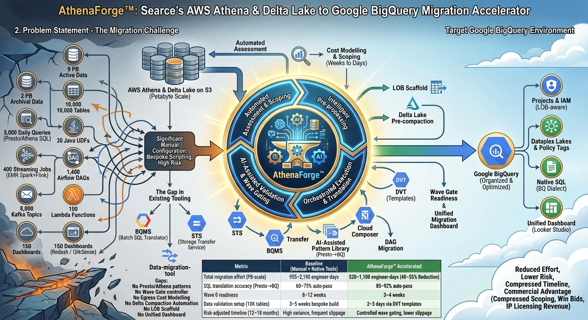

# AthenaForge&trade;

**Searce's AWS Athena & Delta Lake to Google BigQuery Migration Accelerator**

<p align="center">
  
</p>

AthenaForge&trade; is an end-to-end migration accelerator that automates the transition from **AWS Athena / EMR / Delta Lake on S3** to **Google BigQuery** on GCP. It replaces months of manual scripting with a structured, wave-gated pipeline covering SQL translation, data transfer, dependency rewiring, and validation &mdash; reducing migration effort by **40&ndash;55%** and compressing Wave 0 readiness from 8&ndash;12 weeks to **3&ndash;4 weeks**.

---

## Table of Contents

- [Key Metrics](#key-metrics)
- [Modules](#modules)
- [Architecture](#architecture)
- [Project Structure](#project-structure)
- [Getting Started](#getting-started)
- [CLI Reference](#cli-reference)
- [MCP Servers](#mcp-servers)
- [Testing](#testing)
- [Configuration](#configuration)
- [Technology Stack](#technology-stack)
- [License](#license)

---

## Key Metrics

| Metric | Baseline (Manual + Native Tools) | AthenaForge&trade; Accelerated |
|--------|----------------------------------|-------------------------------|
| Total migration effort (PB-scale) | 955&ndash;2,190 engineer-days | 520&ndash;1,100 engineer-days (40&ndash;55% reduction) |
| SQL translation accuracy (Presto&rarr;BQ) | 60&ndash;75% auto-pass | 85&ndash;92% auto-pass |
| Wave 0 readiness | 8&ndash;12 weeks | 3&ndash;4 weeks |
| Data validation setup (10K tables) | 3&ndash;5 weeks bespoke build | 2&ndash;3 days via DVT templates |
| Risk-adjusted timeline (12&ndash;18 months) | High variance, frequent slippage | Controlled wave gating, lower slippage |

---

## Modules

AthenaForge is organized into **5 bounded contexts**, each with its own CLI command group, use cases, and MCP server:

### M1: FoundationForge &mdash; Assessment & Scaffolding

Automated project scaffolding, tier classification, pricing configuration, and Delta Lake health checks.

- **Terraform scaffold generation** &mdash; LOB-aware GCP project, folder, IAM, Dataplex, and DLP templates via Jinja2
- **3-tier table classification** &mdash; Tier 1 (active, small), Tier 2 (active, large), Tier 3 (inactive/archival) based on size, query recency, and complexity
- **BigQuery slot pricing** &mdash; Cost modelling for 1-year and 3-year commitments across Standard/Enterprise/Enterprise Plus editions
- **Delta log health assessment** &mdash; Identifies compaction needs before migration (healthy/warning/critical/blocked)

### M2: SQLForge &mdash; Translation & Validation

AI-assisted Presto/Athena SQL to GoogleSQL translation with a 90+ pattern library.

- **90+ translation patterns** &mdash; Covering string, date, array, aggregate, JSON, window, bitwise, math, regex, map, type casting, conditional, and table functions
- **Batch translation engine** &mdash; Regex-based pattern matching with domain-specific replacement rules
- **MAP/CASCADE dependency analysis** &mdash; Identifies co-migration batches for complex type hierarchies
- **Case sensitivity normalisation** &mdash; Automatic `UPPER()` wrapping for case-insensitive column comparisons
- **UDF classification** &mdash; Categorises UDFs into SQL, JavaScript, or Cloud Run remote functions
- **BigQuery dry-run validation** &mdash; Validates translated queries without execution costs

### M3: TransferForge &mdash; Data Movement

Handles Delta compaction, egress cost modelling, STS jobs, DVT validation, and streaming cutover.

- **Delta compaction planning** &mdash; Pre-migration log compaction to reduce transfer sizes
- **Egress cost modelling** &mdash; AWS credit-aware cost estimation for S3-to-GCS transfer
- **Storage Transfer Service (STS)** &mdash; Automated job creation for bulk data movement
- **Data Validation Tool (DVT)** &mdash; Tiered validation (row count, column aggregates, full row hash) per table tier
- **Streaming cutover** &mdash; Kafka topic migration with consumer lag verification

### M4: WaveForge &mdash; Execution & Governance

Wave-gated migration with parallel run modes, quality gates, rollback evaluation, and KPI reconciliation.

- **Wave planning** &mdash; LOB-aware wave grouping with configurable parallelism
- **Parallel run state machine** &mdash; Shadow &rarr; Reverse Shadow &rarr; Cutover Ready &rarr; Cutting Over &rarr; Completed (with rollback at any stage)
- **6-criteria quality gates** &mdash; DVT pass rate, latency delta, data loss detection, streaming lag, escalation status, and KPI reconciliation
- **Rollback evaluation** &mdash; Automated assessment with configurable thresholds
- **Dashboard migration** &mdash; Redash/QlikSense to Looker Studio migration tracking
- **KPI reconciliation** &mdash; Legacy vs. new platform metric comparison

### M5: DependencyForge &mdash; Ecosystem Rewiring

Dependency scanning, DAG rewriting, Kafka migration, Lambda rewriting, and IAM mapping.

- **Spark/Flink job scanning** &mdash; Identifies Athena dependencies in EMR workloads
- **Airflow DAG rewriting** &mdash; AthenaOperator &rarr; BigQueryInsertJobOperator conversion
- **Kafka topic migration** &mdash; Schema-aware topic configuration migration
- **Lambda function rewriting** &mdash; Detects and flags boto3 Athena SDK patterns
- **IAM permission mapping** &mdash; Lake Formation permissions to BigQuery IAM roles (dataViewer, dataEditor, dataOwner)

---

## Architecture

AthenaForge follows **Clean / Hexagonal Architecture** with strict dependency direction and **Domain-Driven Design** principles:

```
┌─────────────────────────────────────────────────────────┐
│  Presentation Layer                                     │
│  ├── CLI (Click + Rich)                                 │
│  └── MCP Servers (1 per bounded context)                │
├─────────────────────────────────────────────────────────┤
│  Application Layer                                      │
│  ├── Use Cases (Commands)                               │
│  ├── DTOs                                               │
│  └── Orchestration (DAG-based workflow engine)          │
├─────────────────────────────────────────────────────────┤
│  Domain Layer                                           │
│  ├── Entities (frozen dataclasses, domain events)       │
│  ├── Value Objects (immutable, self-validating)         │
│  ├── Domain Services (stateless business logic)         │
│  └── Ports (abstract interfaces)                        │
├─────────────────────────────────────────────────────────┤
│  Infrastructure Layer                                   │
│  ├── Adapters (S3, GCS, local filesystem)               │
│  ├── Repositories (JSON-based persistence)              │
│  ├── MCP Servers (Model Context Protocol)               │
│  ├── Templates (Jinja2 Terraform templates)             │
│  └── Config (DI container, app config)                  │
└─────────────────────────────────────────────────────────┘
```

**Key design decisions:**
- All domain entities are **frozen dataclasses** &mdash; mutations return new instances
- Domain events use **immutable tuples** with `collect_events()` / `clear_events()` pattern
- Status fields use **`str` enums** (`ProjectStatus`, `BatchStatus`, `TransferStatus`, etc.) for type safety with backwards compatibility
- All blocking I/O is wrapped in **`asyncio.to_thread()`** for async compatibility
- Repositories include **path traversal protection** and entity ID validation
- The DAG orchestrator uses **networkx** for topological execution with parallel step support

---

## Project Structure

```
src/athenaforge/
├── domain/
│   ├── entities/             # MigrationProject, TableInventory, Wave, TransferJob, ...
│   ├── value_objects/        # Money, Tier, PatternCategory, WaveStatus, ...
│   ├── services/             # TierClassification, WavePlanner, RollbackEvaluator, ...
│   ├── events/               # 22 domain event types across all bounded contexts
│   └── ports/                # Repository, BigQuery, CloudStorage, DVT, ... interfaces
├── application/
│   ├── commands/
│   │   ├── foundation/       # scaffold, classify, pricing, delta-health, dataplex
│   │   ├── sql/              # translate, map-cascade, normalise-case, classify-udfs, validate
│   │   ├── transfer/         # compact, egress-cost, create-sts, dvt, cutover
│   │   ├── wave/             # plan, parallel-run, rollback, gate, dashboards, kpi
│   │   └── dependency/       # scan, rewrite-dags, kafka, lambdas, iam
│   ├── dtos/                 # Request/response DTOs
│   └── orchestration/        # DAGOrchestrator, MigrationWorkflow, WaveExecutionWorkflow
├── infrastructure/
│   ├── adapters/             # S3, GCS, local filesystem adapters
│   ├── repositories/         # JSON-file repositories with path traversal protection
│   ├── mcp_servers/          # 5 MCP servers (one per bounded context)
│   ├── patterns/             # presto_patterns.yaml (90+ translation patterns)
│   ├── templates/            # 8 Jinja2 Terraform templates
│   └── config/               # AppConfig, DependencyContainer (composition root)
├── presentation/
│   └── cli/                  # Click command groups + Rich console output
└── tests/
    ├── domain/               # Entity, value object, service tests
    ├── application/          # Use case tests (94 tests across all modules)
    ├── infrastructure/       # Pattern loader, repository tests
    └── integration/          # Full migration flow tests
```

**135 source files** | **433 tests** | **90+ SQL translation patterns**

---

## Getting Started

### Prerequisites

- Python 3.11+
- AWS credentials (for S3 access)
- GCP credentials (for BigQuery, GCS, Dataplex)

### Installation

```bash
# Clone the repository
git clone https://github.com/asmeyatsky/athenaforge.git
cd athenaforge

# Install in development mode
pip install -e ".[dev]"

# Verify installation
athenaforge --help
```

### Quick Start

```bash
# 1. Generate Terraform scaffold for your LOBs
athenaforge foundation scaffold \
  --manifest ./manifests/lob_manifest.yaml \
  --output-dir ./output/terraform

# 2. Classify tables into migration tiers
athenaforge foundation classify --inventory-id inv-001

# 3. Translate Presto SQL to BigQuery SQL
athenaforge sql translate \
  --source-dir ./sql/presto \
  --output-dir ./output/translated

# 4. Validate translated queries via BigQuery dry-run
athenaforge sql validate --query-dir ./output/translated

# 5. Run the full end-to-end migration workflow
athenaforge migrate full \
  --manifest ./manifests/lob_manifest.yaml \
  --inventory-id inv-001 \
  --source-dir ./sql/presto \
  --bucket my-s3-bucket \
  --lobs "finance,marketing,engineering"
```

---

## CLI Reference

```
athenaforge [--config PATH] <command-group> <command> [OPTIONS]
```

### `foundation` &mdash; M1: FoundationForge

| Command | Description | Key Options |
|---------|-------------|-------------|
| `scaffold` | Generate Terraform scaffold for all LOBs | `--manifest`, `--output-dir` |
| `classify` | Classify tables into tiers | `--inventory-id` |
| `pricing` | Configure BigQuery slot pricing | `--slots`, `--commitment-years`, `--output-dir` |
| `delta-health` | Check Delta log health for migration readiness | `--bucket`, `--prefix` |

### `sql` &mdash; M2: SQLForge

| Command | Description | Key Options |
|---------|-------------|-------------|
| `translate` | Translate Athena/Presto SQL to BigQuery SQL | `--source-dir`, `--output-dir` |
| `map-cascade` | Analyse MAP/CASCADE dependencies | `--deps-file` |
| `normalise-case` | Wrap columns in UPPER() for case normalisation | `--sql-file`, `--columns`, `--output-file` |
| `classify-udfs` | Classify UDFs into SQL/JS/Cloud Run categories | `--udfs-file` |
| `validate` | Validate translated queries via BigQuery dry-run | `--query-dir` |

### `transfer` &mdash; M3: TransferForge

| Command | Description | Key Options |
|---------|-------------|-------------|
| `compact` | Plan Delta log compaction | `--bucket`, `--prefixes` |
| `egress-cost` | Model data-egress costs | `--total-size-gb`, `--credit-pct` |
| `create-sts` | Create Storage Transfer Service jobs | `--source-buckets`, `--dest-bucket` |
| `dvt` | Run Data Validation Tool checks | `--tier`, `--pairs-file`, `--keys-file` |
| `cutover` | Control streaming pipeline cutover | `--job-id`, `--source-topic`, `--target-topic` |

### `wave` &mdash; M4: WaveForge

| Command | Description | Key Options |
|---------|-------------|-------------|
| `plan` | Plan migration waves | `--inventory-id`, `--lobs`, `--max-parallel` |
| `parallel-run` | Control parallel-run mode for a wave | `--wave-id`, `--target-mode` |
| `rollback-check` | Evaluate whether a wave should be rolled back | `--wave-id`, `--dvt-pass-rate`, `--data-loss-detected` |
| `gate` | Enforce quality gate for a wave | `--wave-id`, `--criteria-file` |
| `dashboards` | Migrate dashboards to the new platform | `--configs-file` |
| `kpi` | Reconcile KPIs between legacy and new platform | `--kpis-file` |

### `dependency` &mdash; M5: DependencyForge

| Command | Description | Key Options |
|---------|-------------|-------------|
| `scan` | Scan for Spark/Flink jobs with Athena dependencies | `--bucket`, `--prefixes` |
| `rewrite-dags` | Rewrite Airflow DAGs from AWS to GCP operators | `--dags-dir` |
| `kafka` | Migrate Kafka topic configurations | `--topics-file` |
| `lambdas` | Scan and rewrite Lambda functions | `--sources-file` |
| `iam` | Map Lake Formation permissions to BigQuery IAM | `--policies-file` |

### `migrate` &mdash; End-to-End Orchestration

| Command | Description | Key Options |
|---------|-------------|-------------|
| `full` | Run the full 9-step migration workflow | `--manifest`, `--inventory-id`, `--source-dir`, `--bucket`, `--lobs`, `--max-parallel` |

The `migrate full` command executes a **9-step DAG**:

```
scaffold → classify_tiers → ┬─ translate_sql ─→ validate_queries ──┐
                             └─ scan_dependencies → rewrite_dags ──┤
                                                                   ├─→ plan_waves → execute_waves → final_report
```

---

## MCP Servers

AthenaForge exposes each bounded context as a **Model Context Protocol (MCP)** server, enabling AI-assisted migration workflows:

| Server | Tools Exposed |
|--------|--------------|
| **FoundationServer** | `generate_scaffold`, `classify_tiers`, `configure_pricing`, `check_delta_health`, `bootstrap_dataplex` |
| **SQLServer** | `translate_batch`, `analyse_map_cascade`, `normalise_case`, `classify_udfs`, `validate_queries` |
| **TransferServer** | `plan_compaction`, `model_egress_cost`, `create_sts_jobs`, `run_dvt_validation`, `control_streaming_cutover` |
| **WaveServer** | `plan_waves`, `control_parallel_run`, `evaluate_rollback`, `enforce_wave_gate`, `migrate_dashboards`, `reconcile_kpis` |
| **DependencyServer** | `scan_spark_flink`, `rewrite_dags`, `migrate_kafka_topics`, `rewrite_lambdas`, `map_iam_permissions` |

All MCP servers include structured error handling, returning JSON error responses instead of crashing on exceptions.

---

## Testing

```bash
# Run the full test suite
pytest

# Run with coverage
pytest --cov=athenaforge --cov-report=term-missing

# Run specific module tests
pytest tests/domain/                          # Domain entities, services, value objects
pytest tests/application/                     # Use case tests (94 tests)
pytest tests/infrastructure/                  # Pattern loader, repositories
pytest tests/integration/                     # End-to-end flow tests

# Run a single test file
pytest tests/application/test_wave_use_cases.py -v
```

**Test coverage by layer:**
- **Domain** (entities, services, value objects): comprehensive state machine, tier classification, and event tests
- **Application** (use cases): 94 tests covering all 26 use cases across all 5 modules
- **Infrastructure** (patterns, repositories): pattern loading, regex validation, YAML integrity
- **Integration**: full migration flow, repository CRUD, DAG orchestration

---

## Configuration

AthenaForge can be configured via a YAML config file or environment variables:

```bash
# Via config file
athenaforge --config ./config.yaml foundation scaffold --manifest ...

# Via environment variables
export ATHENAFORGE_GCP_PROJECT=my-gcp-project
export ATHENAFORGE_AWS_REGION=us-east-1
athenaforge foundation scaffold --manifest ...
```

### SQL Translation Patterns

The pattern library lives at `src/athenaforge/infrastructure/patterns/presto_patterns.yaml` and contains **90+ patterns** across 18 categories:

| Category | Count | Examples |
|----------|-------|---------|
| DATE_FUNCTIONS | 20 | `DATE_TRUNC`, `DATE_ADD`, `DATE_DIFF`, `DATE_FORMAT`, `FROM_UNIXTIME` |
| ARRAY_FUNCTIONS | 14 | `CARDINALITY`, `ELEMENT_AT`, `ARRAY_JOIN`, `CONTAINS`, `FLATTEN` |
| AGGREGATE_FUNCTIONS | 11 | `APPROX_DISTINCT`, `BOOL_AND`, `MAX_BY`, `ARBITRARY`, `ARRAY_AGG` |
| STRING_FUNCTIONS | 10 | `CHR`, `CODEPOINT`, `STRPOS`, `POSITION`, `CONCAT_WS` |
| MATH_FUNCTIONS | 10 | `INFINITY()`, `IS_NAN`, `MOD`, `TRUNCATE`, `RANDOM()` |
| TYPE_CASTING | 10 | `VARCHAR`&rarr;`STRING`, `BIGINT`&rarr;`INT64`, `DOUBLE`&rarr;`FLOAT64` |
| JSON_FUNCTIONS | 6 | `JSON_EXTRACT_SCALAR`, `JSON_FORMAT`, `JSON_PARSE` |
| MISC_FUNCTIONS | 6 | `TYPEOF`, `FROM_HEX`, `UUID`, `CURRENT_TIMEZONE` |
| BITWISE_FUNCTIONS | 5 | `BITWISE_AND`, `BITWISE_OR`, `BITWISE_XOR`, `BIT_COUNT` |
| REGEXP_FUNCTIONS | 5 | `REGEXP_LIKE`, `REGEXP_EXTRACT`, `REGEXP_REPLACE`, `REGEXP_SPLIT` |
| + 8 more categories | 23 | MAP, WINDOW, TABLE, CONDITIONAL, FILTER, TRANSFORM, ... |

Each pattern includes a compiled regex, a GoogleSQL replacement template, and at least one example pair.

---

## Technology Stack

| Component | Technology |
|-----------|-----------|
| Language | Python 3.11+ |
| CLI Framework | Click 8.x + Rich 13.x |
| SQL Parsing | sqlglot 18.x + custom regex patterns |
| Infrastructure-as-Code | Jinja2 Terraform templates |
| Workflow Engine | networkx DAG orchestrator |
| AI Integration | Model Context Protocol (MCP) servers |
| Cloud &mdash; AWS | boto3 (S3, Athena, Lambda) |
| Cloud &mdash; GCP | google-cloud-bigquery, google-cloud-storage, google-cloud-dataplex, google-cloud-dlp |
| Validation | Pydantic 2.x |
| Testing | pytest, pytest-asyncio, pytest-cov, hypothesis |
| Linting | ruff, mypy (strict mode) |
| Build | hatchling |

---

## License

Proprietary &mdash; Searce Inc. All rights reserved.

AthenaForge&trade; is a registered trademark of Searce Inc.
